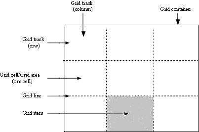

# CSS Grid


## Introduction
> CSS Grid layout, or simply Grid, is a two-dimensional grid-based layout system aims for the design of grid-based user interfaces. It is the very first CSS module created specifically to solve the layout problems; this module provides a series of properties designed specifically to create grids on screen. Grid layout works by applying CSS rules both to a parent element (which becomes the Grid Container) and to that elements children (which become Grid items).

## Terminology
* Grid Container - The element on which `display: grid` property is applied. It's the direct parent of all the grid items.
* Grid Item - Each child element placed in the grid container.

**Example:**
```html
<div class="container">
    <div class="Item 1">Child of container</div>
    <div class="Item 2">Child of container</div>
    <div class="Item 3">Child of container</div>
</div>
```
* Grid Line - The dividing lines that make up the structure of the grid.
* Grid Track - The space between two adjacent grid lines.
* Grid Cell - The space between two adjacent row grid lines and two adjacent column grid lines.
* Grid Area - A cell or multiple cells that mark the space in which a grid item will be placed.




## Parent Properties
* display - It defines the element as a grid container and establishes a new grid formatting context for its contents.

```display
.container {
    display: value;
}

where value:
    * grid - generates a block-level grid
    * inline-grid - generates an inline-level grid
    * subgrid - if the grid container is a nested grid, this property indicates that the sizes of its rows / columns are to be taken from its parent
```

* grid-template-columns - List of space-separated values that defines the width of the columns
* grid-template-rows - List of space-separated values that defines the width of the rows

```grid-template-col-row
.container {
    grid-template-columns: <track-size> ... | <line-name> <track-size> ...;
    grid-template-rows:    <track-size> ... | <line-name> <track-size> ...;
}

where:
    * track-size - Can be a length in px, a percentage, or fraction (fr) of the free space in the grid
    * line-name - Arbitrary name to represent the name of the grid line

Example:

.container {
    grid-template-columns: [first] 40px [line2] 50px [line3] auto [col4-start] 50px [five] 40px [end];
    grid-template-rows: [row1-start] 25% [row1-end] 100px [third-line] auto [last-line];
}
```


* grid-template-areas - Allow us to populate the grid with grid-area names.

```grid-template-area
.container {
    grid-template-areas: <grid-area-name> | . | none;
}

where:
    * grid-area-name - The name of a grid area specified using grid-area property of the grid's children
    * . - Used to signify an empty grid cell
    * none - Use to signify no grid area are defined
```

## Children Properties
* grid-column-start,
* grid-column-end,
* grid-row-start,
* grid-row-end - These four properties determine a grid item's location within the grid by referring to specific grid lines. grid-column-start and grid-row-start determines the line where the grid item begins, and grid-column-end and grid-row-end determines the line where the grid item ends.

```grid-item-start-end
.item {
    grid-column-start: <line number> | <line name> | span <number> | span <name> | auto
    grid-column-end:   <line number> | <line name> | span <number> | span <name> | auto
    grid-row-start:    <line number> | <line name> | span <number> | span <name> | auto
    grid-row-end:      <line number> | <line name> | span <number> | span <name> | auto
}

where:
    * line number - Any line number that refers to a valid numbered grid line
    * line name - Any line name that refers to a valid named grid line
    * span number - The number indicates the item will span across the the provided number of grid tracks
    * span name - The grid item will span across until it reaches the line with the provided name
    * auto - Indicates auto-placement

Example:
.item-a {
    grid-column-start: 1;
    grid-column-end: 3;
    grid-row-start: 1;
    grid-row-end: 2;
}
This will create an item occupying 2 columns by 1 row on the grid
```

* grid-column - Shorthand for grid-column-start and grid-column-end
* grid-row - Shorthand for grid-row-start and grid-row-end

```grid-col-row
.item {
    grid-column: <start line number> | <end line number>
    grid-row:    <start line number> | <end line number>
}

where:
    * line number - Any line number that refers to a valid numbered grid line

Example:
.item-a {
    grid-column: 1 / 3;
    grid-row-start: 1 / 2;
}
This will create an item occupying 2 columns by 1 row on the grid
```

* grid-area - It can either give an item a name to be placed within the grid template or it can act as a shorthand for grid-row-start + grid-column-start + grid-row-end + grid-column-end

```grid-area
.item {
    grid-area: <name> | <row start> / <column start> / <row end> / <column end>
}

where:
    * name - Any name we choose
    * row start /
      column start - Starting row and column line number that refers to a valid numbered grid line
    * row end /
      column end - Ending row and column line number that refers to a valid numbered grid line

Example:
.item-a {
    grid-area: header;
}
This example named an item as header to be used in grid-template-areas

.item-a {
    grid-area: 1 / 1 / 2 / 3;
}
This example will create an item occupying 2 columns by 1 row on the grid
```

### Parent Properties (Continue.....)
* grid-template - A shorthand for setting grid-template-rows, grid-template-columns, and grid-template-areas in a single declaration.

```grid-template
.container {
    grid-template: none | <grid-template-rows> / <grid-template-columns> | subgrid;
}

where:
    * none - Sets all three longhand properties to none. No named grid areas are defined, and rows and columns will be implicitly generated. Their size will be determined by the grid-auto-rows and grid-auto-columns properties
    * <grid-template-rows> / <grid-template-columns> - Sets the grid-template-rows and grid-template-columns to the specified values, and sets grid-template-areas to none.
    * subgrid - Sets grid-template-rows, grid-template-columns, and grid-template-areas with the following format: <line-names> <grid areas string> <track size> <line-names> / <explicit-track-list>

Example:

.container {
    grid-template:
        [row1-start] "header header header" 25px [row1-end]
        [row2-start] "footer footer footer" 25px [row2-end]
        / auto 50px auto;
}

The above declaration, is the same as below declaration using longhand:

.container {
    grid-template-rows: [row1-start] 25px [row1-end row2-start] 25px [row2-end];
    grid-template-columns: auto 50px auto;
    grid-template-areas: "header header header" 
                         "footer footer footer";
}
```

* grid-column-gap - Specifies the size of the column lines
* grid-row-gap - Specifies the size of the row lines
* grid-gap - Shorthand to do grid-row-gap and grid-column-gap in a single declaration

```grid-col-row-gap
.container {
    grid-column-gap: <line-size>;
    grid-row-gap:    <line-size>;
}

where:
    * line-size - A length value

The above declaration can be replaced with:

.container {
    grid-gap: <grid-row-gap-value> <grid-column-gap-value>;
}
```

* grid-auto-columns, 
* grid-auto-rows - Specifies the size of any auto-generated grid tracks that are implicitly created when we explicitly position rows or columns that are out of range of the defined grid.

```grid-auto-col-row
.container {
    grid-auto-columns: <track-size> ...;
    grid-auto-rows:    <track-size> ...;
}

where:
    * track-size - Can be length value, a percentage, or fraction (fr) of the free space in the grid

Example:
.container {
    grid-template-columns: 60px 60px;
    grid-template-rows: 50px 50px;
}

This will create 2 x 2 grid.

Now imagine the following scenario:

.item-a {
    grid-column: 1 / 2;
    grid-row: 2 / 3;
}
This item-a is created within the defined grid. No problem.

.item-b {
    grid-column: 5 / 6;
    grid-row: 2 / 3;
}
And this item-b is created outside the defined grid as we specificaly set grid-column to fifth column and there is no fifth column in the grid.
```


* grid-auto-flow - This property controls the auto placement of grid items that are not explicitly placed on the grid.

```grid-auto-flow
.container {
    grid-auto-flow:  row | column | dense;
}

where:
    * row - The auto-placement algorithm will fill in each row in turn, adding new rows as necessary. This is the default
    * column - The auto-placement algorithm will fill in each column in turn, adding new columns as necessary
    * dense - The auto-placement algorithm will attempt to fill in holes earlier in the grid if smaller items come up later

Example:

<section class="container">
    <div class="item-a">item-a</div>
    <div class="item-b">item-b</div>
    <div class="item-c">item-c</div>
    <div class="item-d">item-d</div>
    <div class="item-e">item-e</div>
</section>

.container {
    display: grid;
    grid-template-columns: 60px 60px 60px 60px 60px;
    grid-template-rows: 30px 30px;
    grid-auto-flow: row;
}

This will create 5 x 2 grid.

Now imagine the following scenario:

.item-a {
    grid-column: 1;
    grid-row: 1 / 3;
}
item-a is placed in first column and second row

.item-e {
  grid-column: 5;
  grid-row: 1 / 3;
}
And item-e is placed in fifth column and second row

And the rest are not placed in the grid.
```

With grid-auto-flow set to row, item-b, item-c, and item-d will be placed as follow


When grid-auto-flow set to column, item-b, item-c, and item-d will be placed as follow


### Miscellaneous Properties
* justify-items - This property aligns content inside a grid item along the row axis
* align-items   - This property aligns content inside a grid item along the column axis

Note: The above properties apply to all grid items inside the container.

```justify-align-items
.container {
    justify-items: start | end | center | stretch;
}

where:
    * start   - Aligns the content to the left end side of the grid area
    * end     - Aligns the content to the right end side of the grid area
    * center  - Aligns the content in the center of the grid area
    * stretch - Fills the entire width of the grid area (default setting)

.container {
    align-items: start | end | center | stretch;
}

where:
    * start   - Aligns the content to the top of the grid area
    * end     - Aligns the content to the bottom of the grid area
    * center  - Aligns the content in the center of the grid area
    * stretch - Fills the entire height of the grid area (default setting)
```

> Sometimes when we define the size of the grid items using non-flexible units like in pixel, we will encounter a situation where the total size of the grid might be less than the size of its grid container. In this case we can set the alignment of the grid items within the grid container using the following two properties.

* justify-content - This property aligns the grid along the row axis
* align-content   - This property aligns the grid along the column axis

```justify-align-content
.container {
    justify-content: start | end | center | stretch | space-around | space-between | space evenly;
}

where:
    * start         - Aligns the grid to the left end side of the grid container
    * end           - Aligns the grid to the right end side of the grid container
    * center        - Aligns the grid in the center of the grid container
    * stretch       - Resizes the grid items to allow the grid to fill the full `width` of the grid container
    * space-around  - Places an even amount of space between each grid item with half-sized spaces on the far ends
    * space-between - Places an even amount of space between each grid item with no space at the far ends
    * space-evenly  - Places an even amount of space between each grid item including the far ends

.container {
    align-content: start | end | center | stretch | space-around | space-between | space-evenly;
}

where:
    * start         - Aligns the grid to the top of the grid container
    * end           - Aligns the grid to the bottom of the grid container
    * center        - Aligns the grid to the center of the grid container
    * stretch       - Resizes the grid items to allow the grid to fill the full `height` of the grid container
    * space-around  - Places an even amount of space between each grid item with half-sized spaces on the far ends
    * space-between - Places an even amount of space between each grid item with no space at the far ends
    * space-evenly  - Places an even amount of space between each grid item including the far ends
```

> To get started you have to define a container element as a grid and applied `display: grid` property into it, set the column and row sizes with `grid-template-columns` and `grid-template-rows` properties, and then place its child elements into the grid with `grid-column` and `grid-row`.

